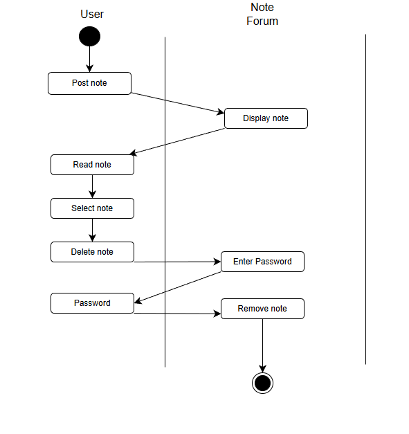
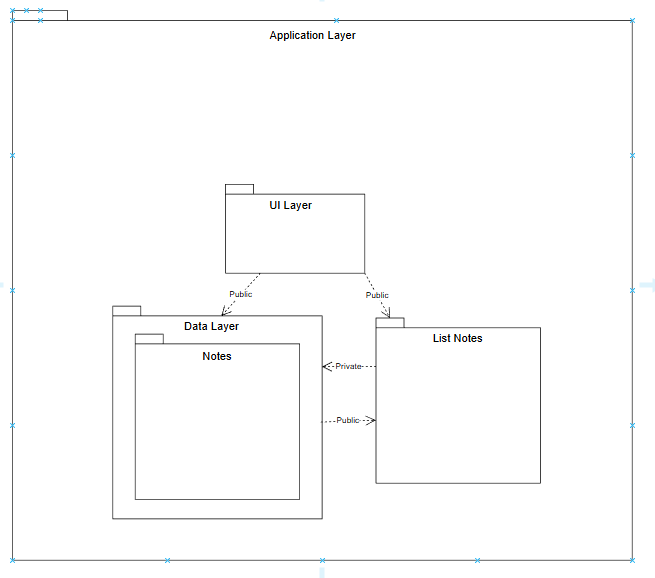
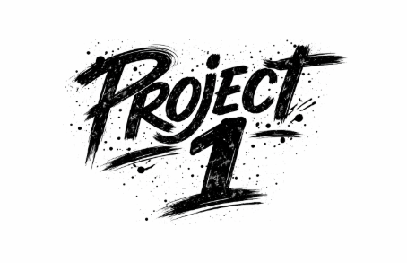

# Project 1
## How to run
* Must have git installed to clone repsitory on terminal.
* Clone the repository
    ```Bash
    git clone <URL for repo>
    ```
* Open the file path
    ```Bash
    cd Project1
    ```
* Starting the local webpage
    ```Bash
    start index.html
    ```
## UML Diagrams
### Use Case

### State Diagrams


### Class Diagrams


### Activity Diagram


### Package Diagram


### Component Diagrams


## Video of Project
Click the image below &darr;

[](https://youtu.be/BdYPwQtZlyI)


