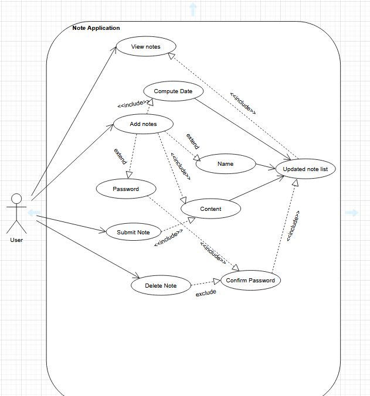
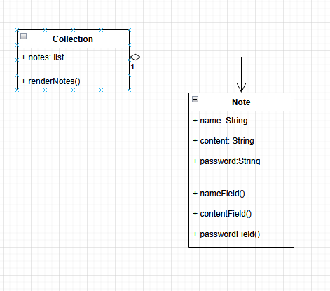

# Project 1
## Overview

## How to run
* Must have git installed to clone repsitory on terminal.
* Clone the repository
    ```Bash
    git clone <URL for repo>
    ```
* Open the file path
    ```Bash
    cd Project1
    ```
* Starting the local webpage
    ```Bash
    start index.html
    ```
## UML Diagrams
### Use Case

### State Diagrams


### Class Diagrams


### Activity Diagram


### Package Diagram


### Component Diagrams


## Video of Project
Click the image below &darr;
<br>
[](https://youtu.be/BdYPwQtZlyI)

### Brief Description
Our system is an application built for users to add notes to a list, for them to be stored, and for them to be deleted if needed. A pratical use of this system is for having a multiple members of a class adding notes about lectures and assignments to one comprehensive list in a neat format.
The technologies we used were html and javascript. Since our system is fairly simple, all we needed were these technologies. The html is present throughout the application, and everytime a user interacts with a button the javascript comes into play. In future iterations, we will use CSS to create a better design of the site.

