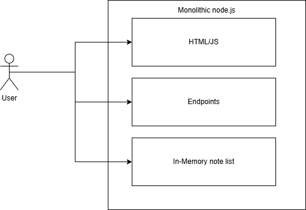
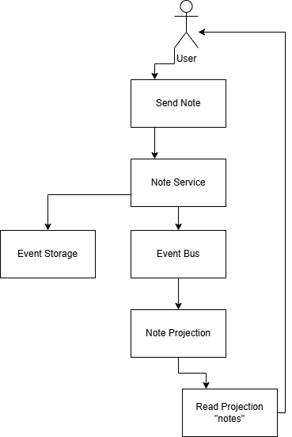
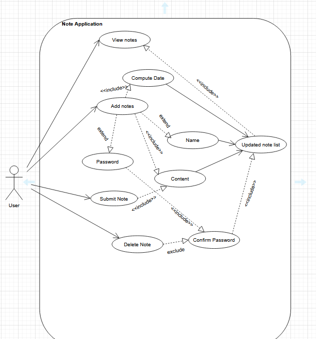
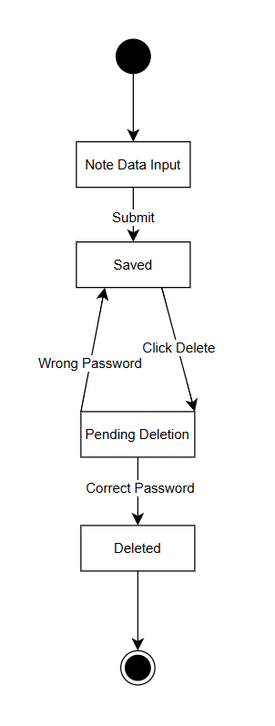
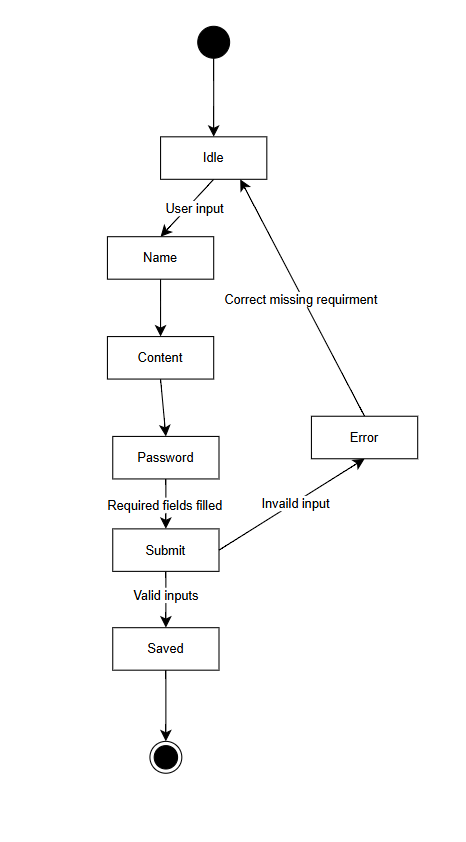
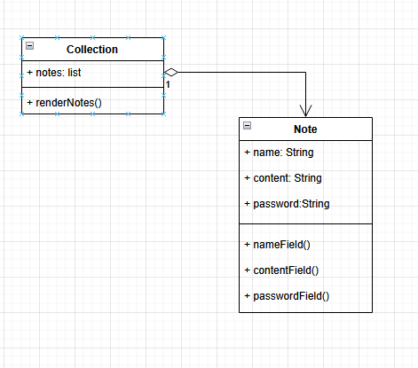
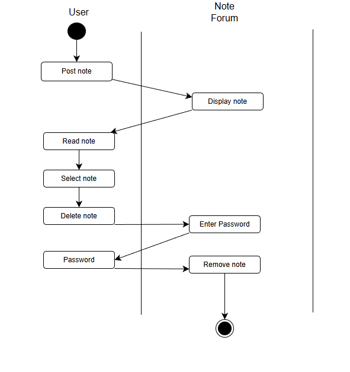
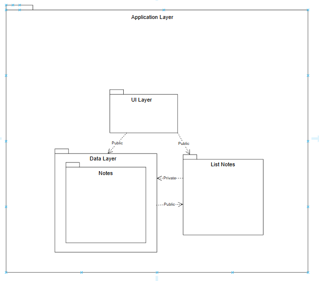
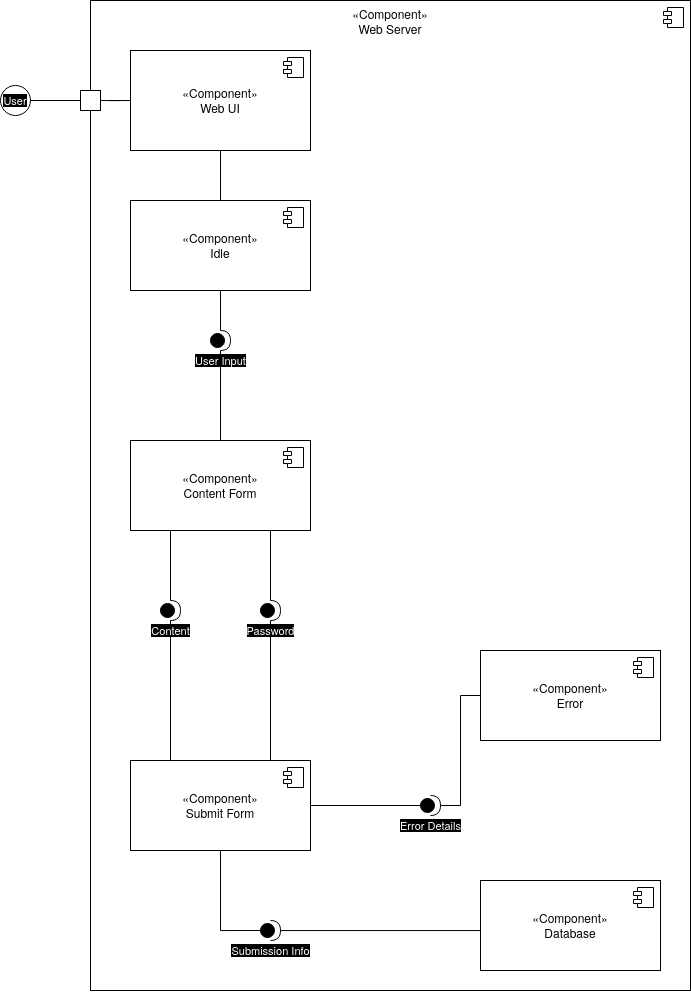
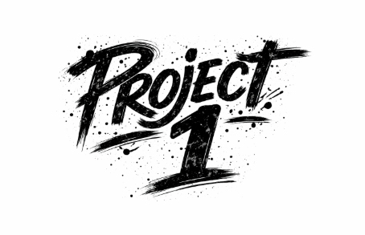

# Project 2
## Overview
Our system is an application built for users to add notes to a list, for them to be stored, and for them to be deleted if needed. A pratical use of this system is for having a multiple members of a class adding notes about lectures and assignments to one comprehensive list in a neat format.
The technologies we used were html and javascript. Since our system is fairly simple, all we needed were these technologies. The html is present throughout the application, and everytime a user interacts with a button the javascript comes into play. In future iterations, we will use CSS to create a better design of the site.
## Architectural Styles
### Monolithic 
#### Rational
We chose a monolithic architecture because the original application is small and has a simple flow. A single Node.js file application keep the everything in one area wich in this case is easy to navigate.
#### Source Code Link
[Monolithic](https://github.com/3legggedcat/Project1/edit/main/architectures/monolithic)
#### High Level Architectire Diagrams

#### Analysis Report
* Maintainability is limited as there isnt a clear structure to the code, but it is easy to navigate as it is a small system.
* Scalability is limited as the structure is not well defind.
* Complexity using monolithic architecture is minimal as this is a simple notes application that is in one file.
#### Recommendation
Monolithic archetecture is good for small rapid build project as it is a simple archtecture. We would recommend to use this archtecture if there is no need to expand the code base or project from this point on.
### Event-Driven 
#### Rational
We used event driven architecture because our system has clear action, creation and deletion of notes. Those to features would become the events in the systems, improving scalibility for future featrures. 
#### Source Code Link
[Event Driven](https://github.com/3legggedcat/Project1/edit/main/architectures/event-driven)
#### High Level Architectire Diagrams

#### Analysis Report
* Performance is more expensive as this system has event storage and projection updates.
* Scalability is better, with defind modular functions.
* Complexity is higher because developer must reason events and projection separately.
#### Recommendation
This project is not a highly scalable project therefor event driven is not needed. If you needed a complex workflow with high throughput, many user added note in a short time frame that gets uploaded to a cloud, then event driven archetecture would be a great archetecture to use.
### Pipe and Filter 
#### Rational
We used Pipe and Filter architecture because the system has a predictable sequence when adding or deleting a note. We can break the workflow into separate filter making a reusable and easier to test system.
#### Source Code Link
[Pipe and Filter](https://github.com/3legggedcat/Project1/edit/main/architectures/pipe-and-filter)
#### High Level Architectire Diagrams

#### Analysis Report
* Performance is good as each request passes through a lightweight filter.
* Maintainability is improved because each filter has one responsibilty and is separate from others.
* Complexity is moderate since stages must be coordinated.
#### Recommendation
Using a pipe and filter for a project like this is not nessecary because there isnt a complex task that need to be broken down. We would recommend to use this type of archetecture if you have a login where you would need to change the step to create a note and delete a note.
## Reflection
Looking at these three archetectural designs we have learned when to use them and when not to use them. Understanding different style of archecture can influcence where time, funds, manpower should be allocated.


# Project 1
## Overview
Our system is an application built for users to add notes to a list, for them to be stored, and for them to be deleted if needed. A pratical use of this system is for having a multiple members of a class adding notes about lectures and assignments to one comprehensive list in a neat format.
The technologies we used were html and javascript. Since our system is fairly simple, all we needed were these technologies. The html is present throughout the application, and everytime a user interacts with a button the javascript comes into play. In future iterations, we will use CSS to create a better design of the site.

## How to run
* Must have git installed to clone repsitory on terminal.
* Must have WSL on windows to run node, can run through VS code terminal.
* Clone the repository
    ```Bash
    git clone <URL for repo>
    ```
* Open the file path
    ```Bash
    cd Project1
    ```
* Starting the local webpage
    ```Bash
    node server.js
    ```
## UML Diagrams
### Use Case

### State Diagrams



### Class Diagrams


### Activity Diagram


### Package Diagram


### Component Diagrams


## Video of Project
Click the image below &darr;
<br>
[](https://youtu.be/BdYPwQtZlyI)


